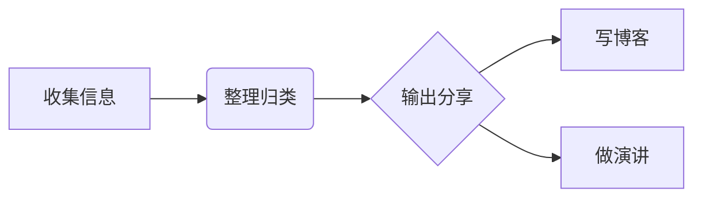
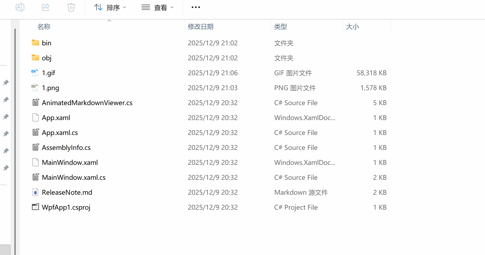

以下是一份约500字的个人知识管理指南Markdown文档，它展示了常见的Markdown语法和实用结构。

# 个人知识管理指南

> 高效的知识管理是提升学习和工作效率的基石。本文档旨在为你提供一套简单易行的个人知识管理方法。

## 一、核心方法论

构建个人知识体系，我们建议遵循以下三个核心步骤：

1.  **收集**
    *   **原则**：使用单一入口（如特定笔记软件）汇集来自文章、书籍、灵感的碎片信息。
    *   **技巧**：善用浏览器的剪藏功能或笔记软件的快速保存插件。

2.  **整理**
    *   **标签化**：为每个笔记打上多个标签（如 `#Markdown`、`#效率工具`），便于多维检索。
    *   **链接**：在不同笔记之间建立双向链接，让知识形成网络而非孤岛。

3.  **输出**
    *   **费曼技巧**：尝试用自己的话解释一个复杂概念，这是检验理解深度的最佳方式。
    *   **实践应用**：将知识应用于实际项目或解决问题中。

## 二、推荐工具流

下表列举了知识管理各环节的推荐工具及其特点：

| 用途 | 工具推荐 | 核心特点 |
| :--- | :--- | :--- |
| **编辑与写作** | Typora, Obsidian, VS Code | 支持实时预览、语法高亮 |
| **文档同步与管理** | GitBook, Docsify | 可将Markdown文档生成静态网站，便于发布 |
| **笔记与知识库** | Notion, 有道云笔记 | 集成度高，支持多维表格等强大数据库功能 |

## 三、基础语法示例

### 1. 代码块
在文档中插入代码片段，不仅清晰，还能进行语法高亮。
```python
# 这是一个Python示例
def greet(name):
    print(f"Hello, {name}!")

greet("World")
```

### 2. 强调与列表
使用加粗、斜体等样式强调关键点，并结合列表梳理逻辑。
*   **首要任务**：明确知识管理的核心目标，*避免陷入盲目收集*。
*   **定期复盘**：每周回顾并整理收集的内容，保持知识库的活性。

### 3. 流程图
部分高级Markdown工具（如支持Mermaid的编辑器）允许你直接绘制流程图。


---
*最后更新：2025-12-09 | 版本：v1.0*  
*希望这份指南能对你有所帮助！* 📚


